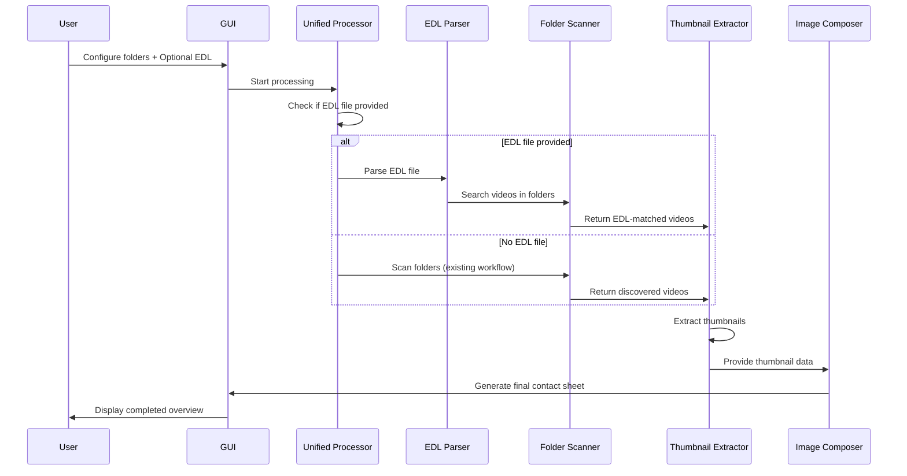
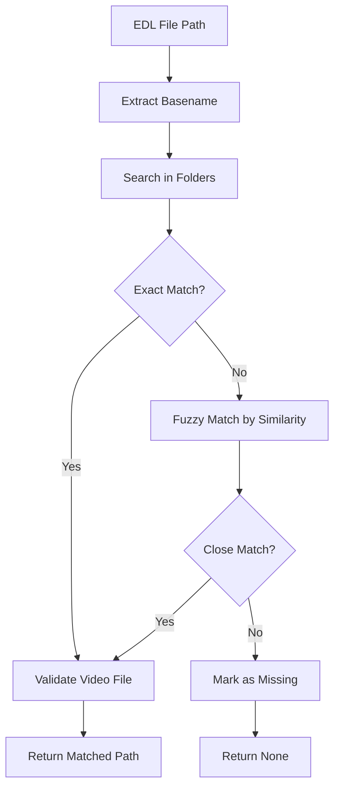

# EDL Thumbnail Generator Feature Design

## Overview

This document outlines the design for seamlessly integrating EDL (Edit Decision List) file support into the existing Footage Thumbnailer application. The feature enhances the current functionality by optionally allowing users to generate thumbnail overviews based on video edit sequences defined in EDL files, while maintaining full backward compatibility with the existing folder-based workflow.

### Key Requirements
- **Seamless Integration**: Works as existing application when no EDL file is provided
- **Optional EDL Mode**: Parse EDL files to extract video file references and edit sequences
- **Intelligent Fallback**: Use folder scanning when EDL file is not specified
- **Unified Processing**: Single workflow handles both EDL and folder-based inputs
- **Backward Compatibility**: All existing features and configurations remain unchanged
- **Enhanced Workflow**: EDL mode provides timeline-based thumbnail generation

## Technology Stack & Dependencies

**Core Technologies:**
- Python 3.9+
- OpenCV for video processing
- FFmpeg for metadata extraction
- CustomTkinter for GUI components

**New Dependencies:**
- No additional external dependencies required
- Utilizes existing PIL, pathlib, and re modules

## Architecture

### Component Overview

```mermaid
graph TD
    A[GUI Application] --> B[EDL Parser]
    A --> C[EDL Video Scanner]
    A --> D[EDL Thumbnail Extractor]
    B --> E[EDL Entry Data Model]
    C --> F[Video File Matcher]
    D --> G[Existing Thumbnail Extractor]
    D --> H[Placeholder Generator]
    
    subgraph "EDL Processing Layer"
        B
        C
        D
        E
        F
    end
    
    subgraph "Core Components"
        G
        H
        I[Image Composer]
    end
    
    D --> I
    
    style "EDL Processing Layer" fill:#e6f3ff
    style "Core Components" fill:#f0f8ff
```

### Data Flow Architecture



## Core Components

### 1. EDL Parser (`core/edl_parser.py`)

Responsible for parsing EDL files and extracting video references.

#### EDL Entry Data Model
```python
@dataclass
class EDLEntry:
    """Represents a single video entry from EDL file."""
    source_id: int
    file_path: str
    media_type: str  # 'VIDEO' or 'AUDIO'
    start_time: Optional[float] = None
    end_time: Optional[float] = None
    track_info: Optional[dict] = None
```

#### Key Methods
- `parse_edl_file(file_path: str) -> List[EDLEntry]`
- `extract_video_entries(entries: List[EDLEntry]) -> List[EDLEntry]`
- `normalize_file_paths(entries: List[EDLEntry]) -> List[EDLEntry]`

#### EDL Format Support
- **Samplitude EDL Format**: Primary target format as shown in bologna.edl
- **Standard EDL Formats**: Basic CMX3600 compatibility
- **File Path Extraction**: Handles quoted file paths with full directory structures

### 2. EDL Video Scanner (`core/edl_video_scanner.py`)

Matches EDL file references with actual video files in specified directories.

#### Core Functionality
- **Filename Matching**: Extract basename from EDL paths and match in search folders
- **Fuzzy Matching**: Handle slight filename variations or missing extensions
- **Recursive Search**: Deep folder traversal for video file discovery
- **File Validation**: Verify matched files are valid video formats

#### Key Methods
- `scan_edl_videos(edl_entries: List[EDLEntry], search_folders: List[str]) -> List[EDLVideoMatch]`
- `match_video_file(edl_entry: EDLEntry, search_folders: List[str]) -> Optional[str]`
- `find_video_files_recursive(folders: List[str]) -> Dict[str, str]`

**Note**: Uses existing `source_folders` from configuration - no separate EDL search folders needed

#### Video Matching Strategy


### 3. EDL Thumbnail Extractor (`core/edl_thumbnail_extractor.py`)

Extends existing thumbnail extraction for EDL-specific requirements.

#### Position Calculation Logic
- **Interval-Based Positions**: Positions represent relative locations within used video segments
- **Timeline Mapping**: Map EDL timeline positions to actual video file positions
- **Proportional Scaling**: Scale position percentages across actual video duration

#### Key Methods
- `extract_edl_thumbnails(video_matches: List[EDLVideoMatch], positions: List[str]) -> List[VideoData]`
- `calculate_video_positions(edl_entry: EDLEntry, config_positions: List[str]) -> List[float]`
- `generate_placeholder_thumbnail(entry: EDLEntry, width: int, height: int) -> Image.Image`

#### Placeholder Generation
- **Missing File Handling**: Generate white/gray placeholder images for missing videos
- **Metadata Overlay**: Display filename and "File Not Found" message
- **Consistent Sizing**: Match placeholder dimensions to configured thumbnail size

### 4. GUI Integration

#### Enhanced Source Folders Section

**Seamless Integration Components**
- Existing folder selection remains completely unchanged
- Optional EDL file selector added below folder list
- Auto-detection of processing mode based on EDL file presence
- Clear visual indication when EDL mode is active
- No mode toggle required - behavior determined by EDL file presence

**Contextual EDL Settings**
- EDL-specific options appear only when EDL file is loaded
- Missing file placeholder configuration
- Position interpretation settings (interval vs. absolute)

#### GUI Layout Extension
```
📁 Source Folders
  [Folder List Display...]
  [Select Folders...] [Clear All]
  
  📄 EDL File (Optional)
  [EDL File: (none selected)] [Browse...] [Clear]
  ℹ️ When EDL file is provided, videos will be sourced from EDL references

⚙️ Basic Settings
  [Existing settings remain unchanged...]
```

#### Integration Points
- **Source Section**: Add optional EDL file selection below existing folder selection
- **Processing Logic**: Automatically route to EDL workflow when EDL file is provided, otherwise use existing folder workflow
- **Unified Interface**: No mode switching required - behavior determined by presence of EDL file
- **Status Updates**: Enhanced progress reporting that adapts to processing type
- **Error Handling**: Graceful fallback to folder mode if EDL processing fails

## API Integration

### Configuration Schema Extension

```json
{
  "edl_file_path": "",
  "edl_show_placeholders": true,
  "edl_interval_positions": true,
  "edl_placeholder_color": "#F0F0F0"
}
```

**Note**: No `edl_mode` flag needed - presence of `edl_file_path` determines processing mode

### Unified Processing Workflow

```python
def process_thumbnails(config: dict) -> bool:
    """Unified processing workflow - handles both EDL and folder modes."""
    
    # Determine processing mode based on EDL file presence
    if config.get('edl_file_path') and os.path.exists(config['edl_file_path']):
        # EDL Mode: Process based on EDL file
        return process_edl_mode(config)
    else:
        # Standard Mode: Process based on source folders (existing workflow)
        return process_folder_mode(config)

def process_edl_mode(config: dict) -> bool:
    """EDL-based processing workflow."""
    # 1. Parse EDL file
    edl_parser = EDLParser()
    entries = edl_parser.parse_edl_file(config['edl_file_path'])
    
    # 2. Match video files in source folders
    video_scanner = EDLVideoScanner()
    matches = video_scanner.scan_edl_videos(entries, config['source_folders'])
    
    # 3. Extract thumbnails
    extractor = EDLThumbnailExtractor()
    video_data = extractor.extract_edl_thumbnails(matches, config['positions'])
    
    # 4. Compose final image
    composer = ImageComposer()
    composer.create_contact_sheet(video_data, config)
    
    return True

def process_folder_mode(config: dict) -> bool:
    """Existing folder-based processing workflow (unchanged)."""
    # Use existing CLIInterface logic
    cli = CLIInterface()
    return cli.process_videos(config)
```

## Data Models & ORM Mapping

### EDL Video Match Model
```python
@dataclass
class EDLVideoMatch:
    """Links EDL entries with found video files."""
    edl_entry: EDLEntry
    matched_file_path: Optional[str]
    is_found: bool
    similarity_score: float = 0.0
    error_message: Optional[str] = None
```

### Enhanced Video Data Model
```python
@dataclass
class EDLVideoData(VideoData):
    """Extends VideoData for EDL-specific information."""
    edl_entry: EDLEntry
    is_placeholder: bool = False
    timeline_position: Optional[float] = None
    interval_duration: Optional[float] = None
```

## Testing Strategy

### Unit Testing
- **EDL Parser Tests**: Validate parsing of various EDL formats
- **Video Matching Tests**: Test filename matching algorithms
- **Position Calculation Tests**: Verify interval-based position mapping
- **Placeholder Generation Tests**: Ensure consistent placeholder creation

### Integration Testing  
- **Backward Compatibility**: Ensure existing folder-based workflow is completely unchanged
- **Seamless Mode Detection**: Verify automatic switching between folder and EDL modes
- **End-to-End EDL Processing**: Complete workflow from EDL file to contact sheet
- **GUI Integration Tests**: Verify UI component interactions and contextual behavior
- **Configuration Tests**: Validate EDL-specific configuration handling without affecting existing settings
- **Error Scenarios**: Test graceful fallback to folder mode when EDL processing fails

### Test Data Requirements
- Sample EDL files in different formats
- Test video files with various codecs and durations
- Edge cases: empty EDL files, invalid paths, corrupted videos

## Implementation Phases

### Phase 1: Seamless Integration Foundation
1. Add optional EDL file selector to existing GUI
2. Implement unified processing workflow with automatic mode detection
3. Create EDL parser for Samplitude format
4. Ensure existing functionality remains completely unchanged

### Phase 2: EDL Processing Core
1. Develop video file matching algorithm using existing source folders
2. Implement interval-based position calculation
3. Add placeholder thumbnail generation for missing files
4. Integrate EDL processing into unified workflow

### Phase 3: Enhancement & Polish
1. Add contextual EDL-specific settings in GUI
2. Implement advanced matching algorithms and fuzzy search
3. Add EDL preview and validation features
4. Optimize performance for large EDL files

## Error Handling & Edge Cases

### EDL File Issues
- **Malformed EDL**: Graceful parsing with error reporting
- **Unsupported Format**: Clear format compatibility messages
- **Empty/Corrupted Files**: Validation with user feedback

### Video File Issues
- **Missing Files**: Generate placeholder thumbnails with clear labeling
- **Access Permissions**: Handle file permission errors gracefully
- **Corrupted Videos**: Skip with error logging, continue processing others

### Processing Edge Cases
- **Large EDL Files**: Progress reporting and memory management
- **Network Paths**: Handle UNC paths and network timeouts
- **Special Characters**: Proper encoding handling for international filenames

## Performance Considerations

### Optimization Strategies
- **Lazy Loading**: Parse EDL entries on-demand
- **Caching**: Cache video file discoveries across searches
- **Parallel Processing**: Concurrent thumbnail extraction where possible
- **Memory Management**: Stream processing for large EDL files

### Scalability Targets
- **EDL Size**: Support EDL files with 1000+ entries
- **Search Performance**: Sub-second matching for typical video libraries
- **Thumbnail Generation**: Maintain existing performance benchmarks
- **Memory Usage**: Limit memory growth for large processing tasks