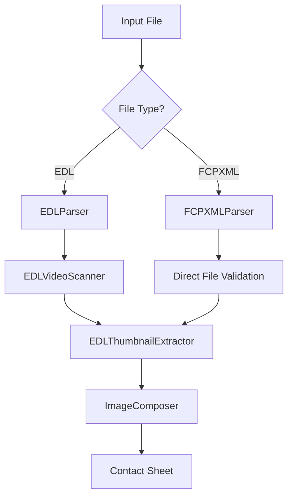

# EDL to FCPXML Support Design Document

## Overview

This document outlines the design for extending the existing EDL (Edit Decision List) support in the Footage Thumbnailer application to include FCPXML (Final Cut Pro XML) file format support. This enhancement will allow users to generate thumbnails directly from FCPXML project files, which contain complete timeline information and absolute file paths to video clips.

## Architecture

### Current EDL Architecture
The existing EDL support follows a modular architecture:
1. **EDLParser**: Parses various EDL formats and extracts video file references
2. **EDLVideoScanner**: Matches EDL file references with actual video files in search directories
3. **EDLThumbnailExtractor**: Extracts thumbnails based on EDL timeline information
4. **UnifiedProcessor**: Orchestrates the workflow between EDL and folder-based modes

### Proposed FCPXML Architecture
The FCPXML support will extend the existing architecture by:
1. Adding a new **FCPXMLParser** that handles FCPXML format parsing
2. Modifying the workflow to bypass the EDLVideoScanner when using FCPXML files (since FCPXML contains absolute paths)
3. Maintaining compatibility with existing EDL components

## Component Design

### 1. FCPXMLParser Class

A new parser class will be created to handle FCPXML files with methods to:
- Parse FCPXML files and extract video entries
- Parse resource definitions from FCPXML
- Parse asset clips from timeline spine
- Extract file paths from asset data

### 2. Integration with UnifiedProcessor

The UnifiedProcessor will be updated to detect FCPXML files and route them appropriately:
- Enhanced file type detection to identify FCPXML files
- New processing workflow for FCPXML files that bypasses directory scanning

### 3. New FCPXML Processing Workflow

A new method will be added to handle FCPXML-specific processing:
- Initialize FCPXML parser
- Parse FCPXML file
- Validate file paths directly (no scanning needed)
- Continue with standard EDL thumbnail extraction

## Data Models

### EDLEntry Extension
The existing EDLEntry dataclass will be used with minimal modifications to represent video entries from FCPXML files.

### EDLVideoMatch Extension
The EDLVideoMatch dataclass will be used to represent file validation results for FCPXML-referenced files.

## File Format Analysis

### FCPXML Structure
Based on the sample file, FCPXML contains:
1. **Resources Section**: Defines all assets with absolute file paths
2. **Library/Event/Project**: Contains timeline structure
3. **Spine/Asset Clips**: References to resources with timing information

Key elements for parsing:
- `<asset>` tags in `<resources>` with `src` attribute containing file URLs
- `<asset-clip>` tags in timeline with `ref` attribute linking to resources
- Timing information in `start`, `duration`, and `offset` attributes

## Implementation Plan

### Phase 1: Core FCPXML Parsing
1. Create FCPXMLParser class
2. Implement XML parsing with built-in xml.etree.ElementTree
3. Extract asset file paths and timing information
4. Convert to EDLEntry format

### Phase 2: Integration with Existing Workflow
1. Modify UnifiedProcessor to detect and route FCPXML files
2. Implement direct file validation (bypassing EDLVideoScanner)
3. Ensure compatibility with existing EDLThumbnailExtractor

### Phase 3: Testing and Validation
1. Create unit tests for FCPXMLParser
2. Add integration tests with sample FCPXML files
3. Validate file path handling across different operating systems

## API Endpoints Reference

### New Methods

#### FCPXMLParser.parse_fcpxml_file()
- **Description**: Parse FCPXML file and extract video entries
- **Parameters**: 
  - `file_path` (str): Path to FCPXML file
- **Returns**: List[EDLEntry]
- **Exceptions**: FileNotFoundError, ValueError

#### UnifiedProcessor._process_fcpxml_mode()
- **Description**: Process thumbnails using FCPXML file
- **Parameters**: 
  - `config` (Dict[str, Any]): Configuration dictionary
- **Returns**: bool (success status)

## Data Models & ORM Mapping

The FCPXML support will use the existing data models with no database ORM requirements, as the application is file-based.

### EDLEntry Fields for FCPXML
| Field | Type | Description |
|-------|------|-------------|
| source_id | int | Sequential identifier |
| file_path | str | Absolute file path from FCPXML |
| media_type | str | Always "VIDEO" for this implementation |
| start_time | float, optional | Clip start time in seconds |
| end_time | float, optional | Clip end time in seconds |
| track_info | Dict, optional | Additional metadata |

## Business Logic Layer

### File Validation Logic
- Validate that FCPXML-referenced files exist
- Convert file:// URLs to local file paths
- Create appropriate match objects for found/missing files

### File URL Conversion
- Convert file:// URL to local file path
- Handle file://localhost/ or file:/// formats
- Convert URL encoding if needed

## Configuration

### New Configuration Parameters
No new configuration parameters are required. The existing `edl_file_path` parameter will accept FCPXML files.

### File Type Detection
File type will be determined by extension:
- `.edl` - Traditional EDL processing
- `.fcpxml` - FCPXML processing

## Testing Strategy

### Unit Tests
1. **FCPXMLParser Tests**
   - Parse sample FCPXML file
   - Extract correct number of video entries
   - Validate file paths are correctly extracted
   - Test timing information extraction

2. **UnifiedProcessor Integration Tests**
   - Verify FCPXML mode detection
   - Test file validation workflow
   - Confirm compatibility with existing EDLThumbnailExtractor

### Test Files
- Sample FCPXML file with multiple video clips
- FCPXML with missing files for error handling tests
- FCPXML with various URL formats

## Security Considerations

1. **File Path Validation**: Ensure only valid local file paths are processed
2. **XML Parsing Safety**: Use built-in XML parser with entity expansion disabled
3. **File Access Control**: Only access files referenced in the FCPXML document

## Performance Considerations

1. **Memory Usage**: FCPXML parsing should be memory-efficient for large projects
2. **File Validation**: Direct file existence checks without directory scanning
3. **Caching**: Leverage existing caching mechanisms where applicable

## Backward Compatibility

This implementation maintains full backward compatibility:
- Existing EDL files continue to work as before
- No changes to configuration file structure
- No impact on folder-based processing mode
- GUI components require no modifications