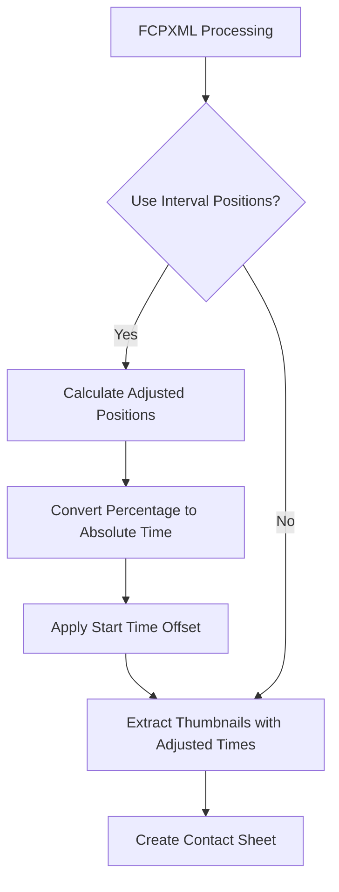
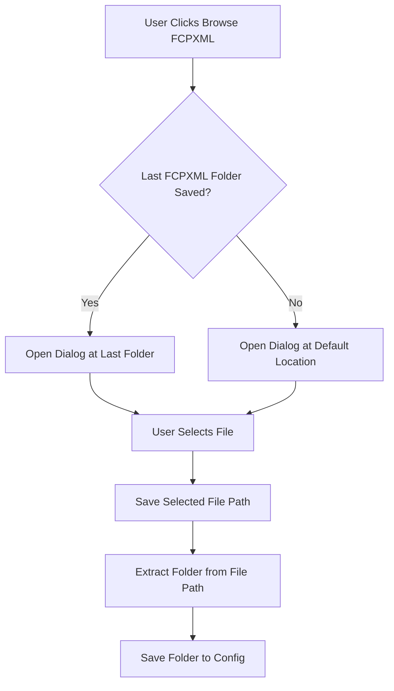
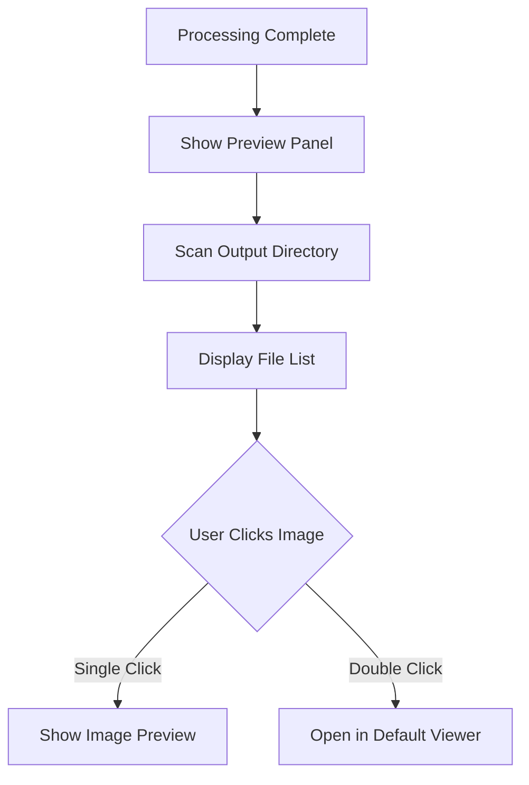
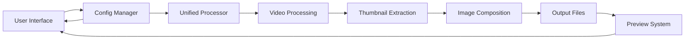
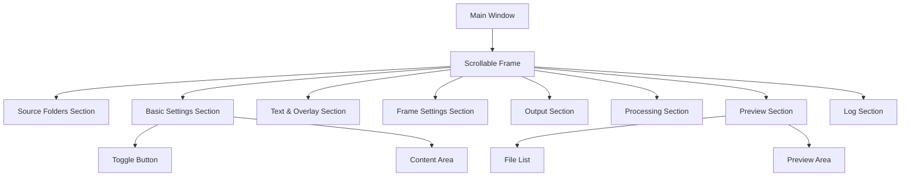

# Footage Thumbnailer - Feature Enhancements and Bug Fixes Design

## Overview

This document outlines the design for implementing four key enhancements to the Footage Thumbnailer GUI application:

1. Fixing the bug where all thumbnails show the last frame when using FCPXML files with in/out points enabled
2. Making the basic settings section collapsed by default (like "text & overlay settings")
3. Remembering the last used folder for FCPXML file selection
4. Adding a preview feature to show results in the output path

These enhancements aim to improve user experience, fix a critical bug, and add valuable functionality to the application.

## Architecture

The design follows the existing modular architecture of the Footage Thumbnailer application:

- **GUI Layer**: CustomTkinter-based interface in `gui_application.py`
- **Core Processing Layer**: Components in `core/` directory for video processing
- **Configuration Layer**: JSON-based configuration management in `config_manager.py`
- **Processing Workflow**: Unified processor in `unified_processor.py` that handles both FCPXML and folder modes

The enhancements will primarily affect the GUI layer with some minor additions to the configuration layer.

## Feature Implementations

### 1. Fix Thumbnail Last Frame Bug

#### Problem Analysis
In the `_extract_fcpxml_thumbnails` method of `UnifiedProcessor`, when `use_interval_positions` is enabled, the code attempts to adjust positions to be relative to the clip's in/out points. However, there's a bug in the position calculation logic where all positions are being set to the same value (the end time of the clip) rather than calculating each position as a percentage within the clip's time range.

#### Solution Design



The fix involves correcting the position calculation logic in the `_extract_fcpxml_thumbnails` method:

1. When `use_interval_positions` is True, properly calculate the absolute time for each percentage position within the clip's in/out points
2. Ensure each position is calculated individually rather than applying the same calculation to all positions
3. Use the correct formula: `absolute_time = start_time + (duration * percentage / 100)` where duration is `entry.end_time - entry.start_time`

#### Implementation Changes
- Modify `unified_processor.py` in the `_extract_fcpxml_thumbnails` method
- Fix the position calculation logic to correctly map percentage positions to absolute times within the clip's time range

### 2. Collapse Basic Settings by Default

#### Problem Analysis
Currently, the basic settings section is expanded by default, unlike the "text & overlay settings" and "frame settings" sections which are collapsed by default. This inconsistency affects the user experience.

#### Solution Design
Modify the GUI to make the basic settings section collapsed by default, consistent with other sections.

#### Implementation Changes
- Modify `gui_application.py` to set the basic settings section to collapsed by default
- Add toggle functionality for the basic settings section similar to existing sections

### 3. Remember Last Used FCPXML Folder

#### Problem Analysis
Each time a user selects an FCPXML file, the file dialog starts from the current working directory rather than remembering the last used location, which is inconvenient for users who work with files in the same directory.

#### Solution Design



#### Implementation Changes
- Add a new configuration parameter `last_fcpxml_folder` to `config_manager.py`
- Modify `gui_application.py` to save the folder path when an FCPXML file is selected
- Modify the `browse_fcpxml_file` method to use the last folder when opening the dialog

### 4. Add Preview for Output Results

#### Problem Analysis
Users currently have no way to preview the generated thumbnails within the application. They need to navigate to the output folder manually to view results.

#### Solution Design



#### Implementation Changes
- Add a new preview panel section in the GUI
- Add functionality to scan the output directory and display a list of generated files
- Implement single-click preview and double-click to open in default viewer
- Add necessary UI components (listbox, preview area, etc.)

## Data Models & Configuration

### New Configuration Parameters

The following new configuration parameters will be added:

| Parameter | Type | Default | Description |
|-----------|------|---------|-------------|
| `last_fcpxml_folder` | string | "" | Last used folder for FCPXML file selection |
| `basic_settings_expanded` | boolean | false | Whether basic settings section is expanded |

### Updated Data Flow



## Business Logic Layer

### FCPXML Position Calculation Fix

The core fix involves correcting the position calculation in `unified_processor.py`:

1. Current (buggy) logic (simplified representation):
   ```python
   # The bug is that the same end time is being used for all positions
   # rather than calculating each position individually
   duration = entry.end_time - entry.start_time
   for pos in positions:
       if pos.endswith('%'):
           percent = float(pos[:-1])
           # Bug: This calculation may be incorrectly applied to all positions
           adjusted_time = entry.start_time + (duration * percent / 100)
           adjusted_positions.append(f"{adjusted_time}s")
   ```

2. Corrected logic:
   ```python
   duration = entry.end_time - entry.start_time
   adjusted_positions = []
   for pos in positions:
       if pos.endswith('%'):
           percent = float(pos[:-1])
           # Calculate each position individually
           adjusted_time = entry.start_time + (duration * percent / 100)
           adjusted_positions.append(f"{adjusted_time}s")
       else:
           # Handle absolute time positions
           adjusted_positions.append(pos)
   ```

### Preview System Logic

The preview system will:

1. Monitor the output directory for changes
2. Display a list of generated image files
3. Show a preview when a file is selected
4. Open files in the default viewer on double-click

## UI Component Architecture

### Modified Sections

1. **Basic Settings Section**:
   - Add expand/collapse functionality
   - Set to collapsed by default

2. **Preview Panel**:
   - Add new section below processing controls
   - Include file list and preview area
   - Add refresh button to update file list

### UI Component Hierarchy



## Testing Strategy

### Unit Tests

1. **Position Calculation Tests**:
   - Test various percentage positions with different in/out points
   - Verify edge cases (0%, 100%, negative values)
   - Test with clips of different durations

2. **Configuration Tests**:
   - Test saving and loading of new configuration parameters
   - Verify default values are correctly applied
   - Test backward compatibility

3. **Preview System Tests**:
   - Test file listing functionality
   - Test preview rendering
   - Test double-click to open files

### Integration Tests

1. **FCPXML Processing Flow**:
   - Test complete workflow with FCPXML files
   - Verify thumbnails are extracted at correct positions
   - Test with various FCPXML file structures

2. **UI State Persistence**:
   - Test that UI state is correctly saved and restored
   - Verify folder paths are remembered between sessions
   - Test section expand/collapse states

## Implementation Plan

### Phase 1: Bug Fix Implementation
1. Fix the FCPXML position calculation bug in `unified_processor.py`
2. Add unit tests for position calculations
3. Verify fix with test FCPXML files

### Phase 2: UI Enhancements
1. Modify basic settings to be collapsed by default
2. Add folder memory functionality for FCPXML files
3. Implement preview panel UI components

### Phase 3: Preview System
1. Implement file listing functionality
2. Add preview rendering capabilities
3. Implement double-click to open in default viewer

### Phase 4: Testing and Validation
1. Run unit tests for all new functionality
2. Perform integration testing
3. Validate with real-world FCPXML files
4. User acceptance testing

## Dependencies and Constraints

### Technical Dependencies
1. Existing CustomTkinter framework for UI components
2. Pillow library for image preview functionality
3. OS-specific file handling for opening files in default viewer

### Performance Considerations
1. Preview system should not block the main UI thread
2. Image previews should be scaled appropriately to avoid memory issues
3. File system monitoring should be efficient

### Backward Compatibility
1. New configuration parameters must default to values that maintain existing behavior
2. Existing FCPXML files should continue to work without modification
3. GUI layout changes should not break existing user workflows

## Security Considerations

1. File path validation for FCPXML files and output directories
2. Safe handling of image files in preview system
3. Proper error handling for file operations
4. No network or external API dependencies introduced