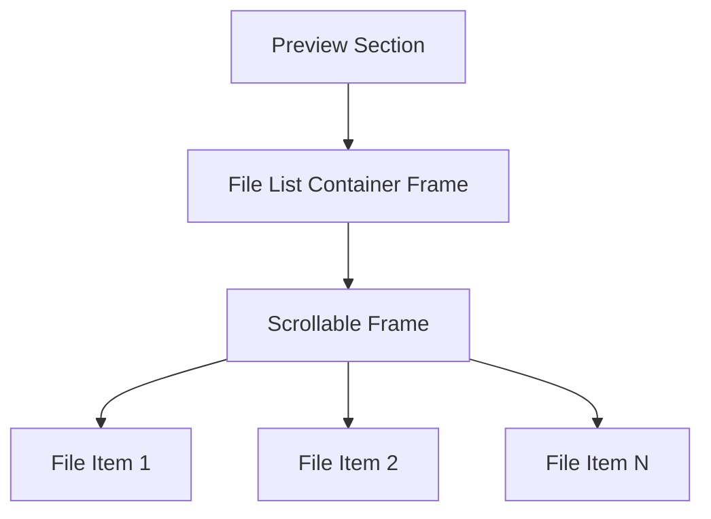
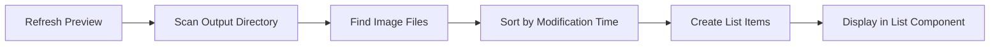

# GUI File List Enhancement Design

## Overview

This document outlines the design for enhancing the file list display in the Footage Thumbnailer GUI application. The enhancements include:

1. Replacing the current text-based display with a proper list component
2. Implementing double-click functionality to open files in the default image viewer
3. Improving the visual presentation and interaction with the file list

## Current Implementation Analysis

The current implementation uses a `CTkTextbox` widget to display generated files in the preview section. Files are displayed as text lines with filename and modification time. Single-clicking on a file shows a preview, but there's no double-click functionality to open files in the default viewer.

## Proposed Enhancements

1. Replace the `CTkTextbox` with a proper list component using `CTkScrollableFrame` with individual file item frames
2. Implement double-click functionality to open selected files in the default image viewer
3. Improve the visual presentation and interaction with the file list
4. Add visual feedback for selected items

## Component Architecture

### File List Component
- **Type**: Custom list component using `CTkScrollableFrame` with individual file item frames
- **Location**: Preview section in `gui_application.py`
- **Parent**: `preview_file_list` frame

### File Item Component
- **Type**: Individual clickable `CTkFrame` items representing generated files
- **Properties**:
  - Filename (`CTkLabel`)
  - Modification timestamp (`CTkLabel`)
  - Visual selection state
  - Click and double-click event handlers

## Implementation Details

### 1. UI Component Replacement

Replace the current `CTkTextbox` with a custom scrollable list implementation using `CTkScrollableFrame`:



### 2. File Item Structure

Each file item will be a `CTkFrame` containing:
- `CTkLabel` for filename
- `CTkLabel` for modification time
- Visual styling for hover and selection states

### 3. Event Handling

Implement two types of click events:
- **Single Click**: Preview the selected file (existing functionality)
- **Double Click**: Open file in default system viewer (new functionality)

## Data Flow



## Technical Implementation

### 1. Component Replacement

Replace the existing `preview_file_list` (CTkTextbox) with a custom scrollable list:

```python
# Current implementation in create_preview_section method
self.preview_file_list = ctk.CTkTextbox(file_list_frame, width=200, height=150)

# New implementation
self.preview_file_list_frame = ctk.CTkScrollableFrame(file_list_frame, width=200, height=150)
self.preview_file_list_items = []  # Track list items for selection management
self.selected_file_item = None    # Track currently selected item
```

### 2. File Item Creation

Create individual file items as frames with labels:

```python
def create_file_item(self, parent, file_path):
    # Create item frame with visual styling
    item_frame = ctk.CTkFrame(parent, fg_color="transparent")
    item_frame.grid_columnconfigure(0, weight=1)
    item_frame.grid(sticky="ew", padx=2, pady=1)
    
    # Store file path reference
    item_frame.file_path = file_path
    
    # Make the frame clickable
    item_frame.bind("<Button-1>", lambda e: self.on_file_item_click(item_frame))
    item_frame.bind("<Double-Button-1>", lambda e: self.on_file_item_double_click(file_path))
    
    # Filename label
    filename_label = ctk.CTkLabel(item_frame, text=file_path.name)
    filename_label.grid(row=0, column=0, sticky="w", padx=5, pady=2)
    filename_label.bind("<Button-1>", lambda e: self.on_file_item_click(item_frame))
    filename_label.bind("<Double-Button-1>", lambda e: self.on_file_item_double_click(file_path))
    
    # Modification time label
    mod_time = file_path.stat().st_mtime
    mod_time_str = datetime.fromtimestamp(mod_time).strftime("%Y-%m-%d %H:%M:%S")
    time_label = ctk.CTkLabel(item_frame, text=mod_time_str, text_color="gray70", font=ctk.CTkFont(size=10))
    time_label.grid(row=1, column=0, sticky="w", padx=5, pady=(0, 2))
    time_label.bind("<Button-1>", lambda e: self.on_file_item_click(item_frame))
    time_label.bind("<Double-Button-1>", lambda e: self.on_file_item_double_click(file_path))
    
    # Store label references for styling
    item_frame.filename_label = filename_label
    item_frame.time_label = time_label
    
    return item_frame
```

### 3. Event Handlers

Implement new event handlers for file item interactions:

```python
def on_file_item_click(self, item_frame):
    """Handle single click on a file item."""
    # Update visual selection
    if self.selected_file_item:
        self.selected_file_item.configure(fg_color="transparent")
    
    item_frame.configure(fg_color=("gray80", "gray20"))  # Selected state
    self.selected_file_item = item_frame
    
    # Update preview
    self.selected_preview_file = item_frame.file_path
    self.show_preview_image(item_frame.file_path)

def on_file_item_double_click(self, file_path):
    """Handle double click on a file item to open in default viewer."""
    try:
        import subprocess
        import platform
        
        # Open file with default application based on OS
        system = platform.system()
        if system == "Windows":
            subprocess.run(["start", str(file_path)], shell=True)
        elif system == "Darwin":  # macOS
            subprocess.run(["open", str(file_path)])
        else:  # Linux and others
            subprocess.run(["xdg-open", str(file_path)])
    except Exception as e:
        self.log_message(f"Error opening file: {e}")
        messagebox.showerror("Error", f"Could not open file: {e}")
```

### 4. Refresh Function Update

Update the `refresh_preview` method to populate the new list component:

```python
def refresh_preview(self):
    """Refresh the preview file list using the new list component."""
    try:
        # Clear existing items
        for item in self.preview_file_list_items:
            item.destroy()
        self.preview_file_list_items.clear()
        
        # Get output path from config
        config = self.config_manager.load_config()
        output_path = config.get('output_path', 'output/overview.jpg')
        output_dir = Path(output_path).parent
        
        # Check if directory exists
        if not output_dir.exists():
            # Handle missing directory case
            return
        
        # List image files in the directory
        image_extensions = ['.jpg', '.jpeg', '.png']
        image_files = []
        
        for file_path in output_dir.iterdir():
            if file_path.is_file() and file_path.suffix.lower() in image_extensions:
                image_files.append(file_path)
        
        # Sort files by modification time (newest first)
        image_files.sort(key=lambda x: x.stat().st_mtime, reverse=True)
        
        # Create list items for each file
        for file_path in image_files:
            item = self.create_file_item(self.preview_file_list_frame, file_path)
            self.preview_file_list_items.append(item)
        
        # Select the first file and show its preview if available
        if image_files:
            self.selected_preview_file = image_files[0]
            self.show_preview_image(image_files[0])
            
    except Exception as e:
        self.log_message(f"Error refreshing preview: {e}")
```

## Cross-Platform Compatibility

The implementation will support all major operating systems:
- **Windows**: Uses `start` command
- **macOS**: Uses `open` command
- **Linux**: Uses `xdg-open` command

## Error Handling

Proper error handling will be implemented for:
- File not found errors
- Permission errors
- Unsupported file types
- System command execution failures

## Testing Strategy

### Unit Tests
- Test file item creation with various file types
- Test event handlers with mock file paths
- Test cross-platform command execution

### Integration Tests
- Verify list population with actual files
- Test single-click preview functionality
- Test double-click file opening functionality

## UI/UX Improvements

### Visual Enhancements
- Selected item highlighting
- Hover effects on list items
- Improved spacing and padding
- Consistent styling with rest of application

### Interaction Improvements
- Keyboard navigation support
- Scrollbar for long file lists
- Visual feedback during file operations

## Backward Compatibility

The changes will maintain backward compatibility with:
- Existing configuration files
- All supported Python versions
- Current API for other components

## Performance Considerations

- Efficient file scanning and sorting
- Lazy loading for large file lists
- Proper resource cleanup
- Minimal impact on application startup time