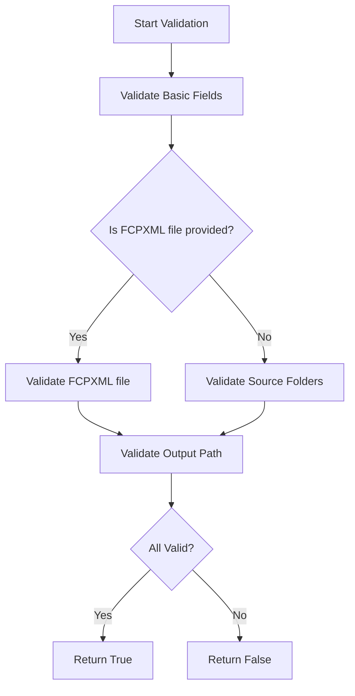

# Fix Input Validation for FCPXML Mode

## Overview
This document outlines the fix for the incorrect input validation error that occurs when using an FCPXML file without specifying source folders in the GUI application. Currently, the application incorrectly requires source folders even when an FCPXML file is provided, which should not be necessary since FCPXML files contain absolute paths to video files.

## Problem Statement
When a user:
1. Selects an FCPXML file
2. Leaves source folders empty
3. Clicks "Generate Overview"

The application shows the error message "Please fix input validation errors before processing" even though this configuration is valid for FCPXML mode.

## Root Cause Analysis
The issue is in the `validate_all_inputs` method in `src/gui/gui_application.py`. The method always validates that source folders are not empty, regardless of whether an FCPXML file is provided. However, when an FCPXML file is used, source folders are not required since the FCPXML file contains absolute paths to the video files.

## Solution Design

### Approach
Modify the input validation logic to conditionally validate source folders only when not in FCPXML mode. When an FCPXML file is provided, source folders become optional.

### Detailed Changes

#### In `src/gui/gui_application.py`

1. Update the `validate_all_inputs` method to conditionally validate source folders:

```python
def validate_all_inputs(self) -> bool:
    """Validate all input fields."""
    validators = [
        self.validate_thumbnail_width,
        self.validate_clips_per_row,
        self.validate_positions,
        self.validate_font_size,
        self.validate_frame_thickness,
        self.validate_frame_padding,
        self.validate_max_rows,
        self.validate_padding
    ]
    
    all_valid = all(validator() for validator in validators)
    
    # Check if FCPXML file is provided
    fcpxml_file = self.fcpxml_file_var.get().strip()
    is_fcpxml_mode = bool(fcpxml_file) and os.path.exists(fcpxml_file) and os.path.isfile(fcpxml_file)
    
    # Validate source folders only when not in FCPXML mode
    folders = self.get_current_folders()
    if not is_fcpxml_mode and not folders:
        self.log_message("Error: No source folders selected")
        all_valid = False
    
    # Validate FCPXML file when in FCPXML mode
    if is_fcpxml_mode:
        if not fcpxml_file.lower().endswith('.fcpxml'):
            self.log_message("Error: FCPXML file must have .fcpxml extension")
            all_valid = False
        # Additional FCPXML validation can be added here if needed
    
    # Validate output path
    output_path = self.output_path_var.get().strip()
    if not output_path:
        self.log_message("Error: Output path cannot be empty")
        all_valid = False
    
    return all_valid
```

### Flowchart of Updated Validation Logic



## Summary

The fix involves modifying the input validation logic in the GUI application to properly handle FCPXML mode. When an FCPXML file is provided, source folders are no longer required since the FCPXML file contains absolute paths to video files. This change maintains backward compatibility while fixing the incorrect validation error.

## Testing Strategy

### Unit Tests
1. Test validation with FCPXML file and empty source folders (should pass)
2. Test validation with FCPXML file and invalid extension (should fail)
3. Test validation without FCPXML file and empty source folders (should fail)
4. Test validation without FCPXML file and valid source folders (should pass)

### Integration Tests
1. End-to-end test with FCPXML file processing
2. End-to-end test with folder-based processing

## Backward Compatibility
This change maintains backward compatibility as it only relaxes validation requirements when appropriate (in FCPXML mode) and keeps all existing validation for folder-based mode.

## Security Considerations
No security implications as this change only affects input validation logic and doesn't introduce new data sources or processing paths.

## Performance Impact
Negligible performance impact as the validation logic is minimal and only adds a few conditional checks.