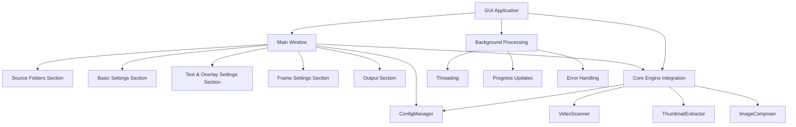
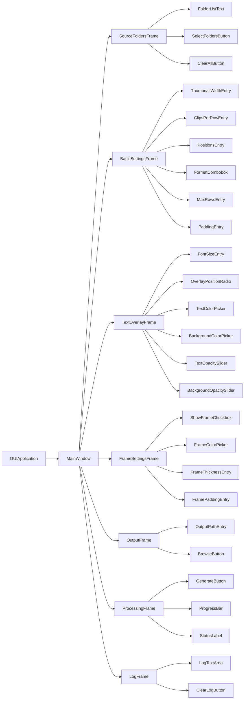
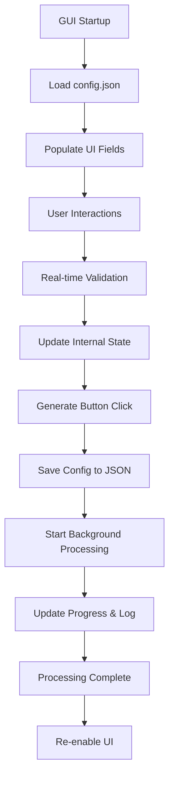
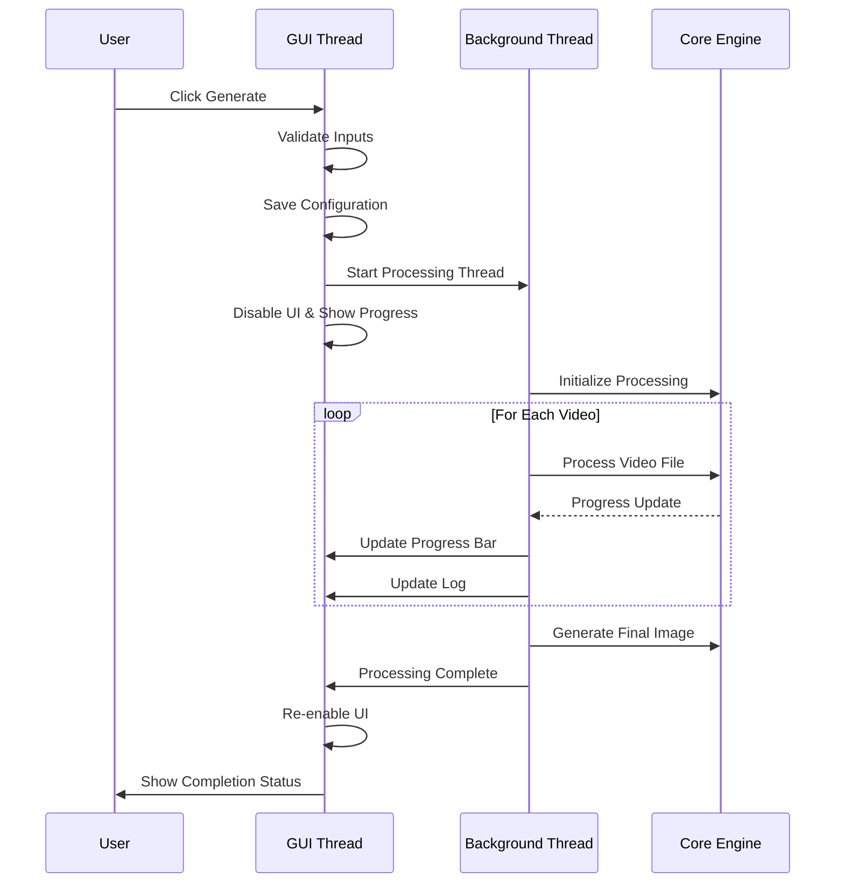

# GUI Application Implementation Design

## Overview

This document outlines the design for implementing a desktop GUI application for the Footage Thumbnailer project. The GUI will provide an intuitive interface for non-technical users while maintaining full feature parity with the existing CLI implementation. The application will be built using CustomTkinter framework to provide a modern, clean interface that works across different operating systems.

## Technology Stack & Dependencies

- **GUI Framework**: CustomTkinter (v5.2.0+) - Modern, customizable tkinter wrapper
- **Core Engine**: Existing Python modules (video_scanner, thumbnail_extractor, image_composer)
- **Configuration**: JSON-based configuration management via ConfigManager
- **Threading**: Python's threading module for background processing
- **File Dialogs**: Native OS dialogs via tkinter.filedialog

## Component Architecture

### GUI Application Structure



### Component Hierarchy



## Core Features

### Source Folders Management
- **Multi-line text display** showing selected folder paths
- **Folder selection dialog** with multi-select capability
- **Clear all functionality** to remove all selected folders
- **Persistent storage** of folder selections in config.json

### Settings Configuration
- **Thumbnail Width**: Numeric input (100-1000 pixels) with real-time validation
- **Clips Per Row**: Numeric input (1-10) with validation
- **Thumbnail Positions**: Text input for comma-separated values (percentages or time)
- **Output Format**: Dropdown selection (JPEG, PNG)
- **Font Size**: Numeric input for text overlay font size
- **Overlay Position**: Radio buttons (Above Thumbnails / On Thumbnails)
- **Frame Options**: Checkbox to enable/disable, color picker, thickness and padding settings
- **Text Colors**: Color pickers for text and background colors
- **Overlay Opacity**: Slider controls for text and background opacity
- **Multi-page Settings**: Max rows per image configuration
- **Real-time validation** with visual feedback for invalid inputs

### Output Management
- **Output path display** showing current destination file
- **Browse functionality** using native "Save As" dialog
- **Automatic extension handling** based on selected format

### Processing Control
- **Generate button** as primary action trigger
- **Progress bar** showing real-time completion percentage
- **Status display** showing current processing stage
- **Background threading** to maintain UI responsiveness

### Logging System
- **Scrollable log area** displaying real-time processing updates
- **Auto-scroll** to latest entries
- **Clear log functionality** for reset
- **Timestamped entries** for better tracking

## Data Models & Configuration

### Configuration Schema
```json
{
  "source_folders": ["C:/path1", "D:/path2"],
  "output_path": "output/overview.jpg",
  "thumbnail_width": 320,
  "clips_per_row": 5,
  "positions": "0%,50%,99%",
  "padding": 5,
  "supported_extensions": [".mp4", ".mov", ".avi", ".mkv", ".mts"],
  "font_size": 12,
  "overlay_opacity": 0.7,
  "background_color": "white",
  "text_color": "black",
  "overlay_background_color": "black",
  "overlay_background_opacity": 0.7,
  "overlay_position": "above_thumbnails",
  "show_frame": true,
  "frame_color": "#CCCCCC",
  "frame_thickness": 2,
  "frame_padding": 10,
  "max_rows_per_image": 0
}
```

### GUI State Management
- **Input validation states** for each form field
- **Processing states** (idle, processing, complete, error)
- **UI enable/disable states** during processing
- **Progress tracking** for background operations

## Business Logic Layer

### Configuration Integration


### Processing Workflow


## User Interface Design

### Main Window Layout
```
┌─────────────────────────────────────────────────────────────────┐
│ Footage Thumbnailer                                    [_][□][×] │
├─────────────────────────────────────────────────────────────────┤
│                                                                 │
│ 📁 Source Folders                                               │
│ ┌─────────────────────────────────────────────────────────────┐ │
│ │ C:\Users\YourUser\Videos\Trip1                              │ │
│ │ D:\Footage\Project_Alpha                                    │ │
│ └─────────────────────────────────────────────────────────────┘ │
│ [Select Folders...] [Clear All]                                 │
│                                                                 │
│ ⚙️ Basic Settings                                               │
│ ┌─────────────────────────┬─────────────────────────────────────┐ │
│ │ Thumbnail Width:        │ Clips Per Row:                      │ │
│ │ [320        ] px        │ [4        ]                         │ │
│ │ Thumbnail Positions:    │ Output Format:                      │ │
│ │ [0%,50%,99%      ]      │ [JPEG ▼]                            │ │
│ │ Max Rows Per Image:     │ Padding:                            │ │
│ │ [0         ] (0=all)    │ [5        ] px                      │ │
│ └─────────────────────────┴─────────────────────────────────────┘ │
│                                                                 │
│ 🎨 Text & Overlay Settings                                      │
│ ┌─────────────────────────┬─────────────────────────────────────┐ │
│ │ Font Size:              │ Overlay Position:                   │ │
│ │ [12       ] px          │ ○ Above Thumbnails ● On Thumbnails  │ │
│ │ Text Color: [⬛] Black   │ Background: [⬛] Black              │ │
│ │ Text Opacity: ●────○    │ BG Opacity:  ●───○                 │ │
│ │         70%             │         70%                         │ │
│ └─────────────────────────┴─────────────────────────────────────┘ │
│                                                                 │
│ 🖼️ Frame Settings                                               │
│ ┌─────────────────────────────────────────────────────────────┐ │
│ │ ☑ Show Frame Borders                                        │ │
│ │ Frame Color: [⬛] #CCCCCC   Thickness: [2  ] px             │ │
│ │ Frame Padding: [10      ] px                                │ │
│ └─────────────────────────────────────────────────────────────┘ │
│                                                                 │
│ 📤 Output                                                       │
│ Output Path: [C:\Users\YourUser\Documents\overview.jpg        ] │
│ [Browse...]                                                     │
│                                                                 │
│                        [Generate Overview]                      │
│                                                                 │
│ Progress: ████████████████████░░░░░░░░░░ 67% (Processing...)    │
│                                                                 │
│ 📋 Log                                                          │
│ ┌─────────────────────────────────────────────────────────────┐ │
│ │ [10:30:15] Found 24 video files in selected folders        │ │
│ │ [10:30:16] Processing: family_dinner.mp4 (12 of 24)       │ │
│ │ [10:30:17] Extracted 3 thumbnails from family_dinner.mp4  │ │
│ │ [10:30:18] Multi-page output: Creating page 2...           │ │
│ └─────────────────────────────────────────────────────────────┘ │
└─────────────────────────────────────────────────────────────────┘
```

### Input Validation Strategy
- **Real-time validation** on field focus loss
- **Visual indicators** for invalid inputs (red borders, error tooltips)
- **Range validation** for numeric fields (thumbnail width, clips per row, font size)
- **Format validation** for positions field and color hex codes
- **Opacity slider constraints** (0.0 to 1.0 range)
- **Frame settings validation** (thickness and padding positive integers)
- **Color picker validation** for hex color formats
- **Multi-page settings validation** (non-negative integer for max rows)
- **Immediate feedback** without blocking user interaction

### Responsive Design
- **Minimum window size**: 800x600 pixels (increased for additional settings)
- **Resizable components** that scale with window size
- **Collapsible sections** for advanced settings organization
- **Tabbed interface** option for complex settings groups
- **Proper spacing** and padding for readability
- **Cross-platform compatibility** with native look and feel

## Testing Strategy

### Unit Testing Components
- **Configuration management** validation and persistence for all new settings
- **Input validation** logic for all form fields including color pickers and sliders
- **Threading safety** for background processing
- **Error handling** for file operations and processing failures
- **Color conversion** utilities for hex/RGB validation
- **Opacity calculation** and slider value mapping
- **Frame settings** validation and application logic
- **Multi-page output** logic and file naming conventions

### Integration Testing
- **Core engine integration** with GUI components including new overlay and frame features
- **Configuration file** loading and saving with all new parameters
- **Progress updates** from background thread to UI
- **File dialog** integration and path handling
- **Color picker** integration with configuration system
- **Slider components** value synchronization with config
- **Multi-page processing** workflow and output validation

### User Interface Testing
- **Component rendering** across different screen sizes with expanded settings
- **User interaction flows** from folder selection to completion with all new options
- **Settings persistence** across application restarts
- **Color picker functionality** and visual feedback
- **Slider responsiveness** and value display
- **Radio button groups** for overlay positioning
- **Checkbox states** for frame enable/disable
- **Error scenarios** and graceful failure handling
- **Performance testing** with large video collections and complex settings